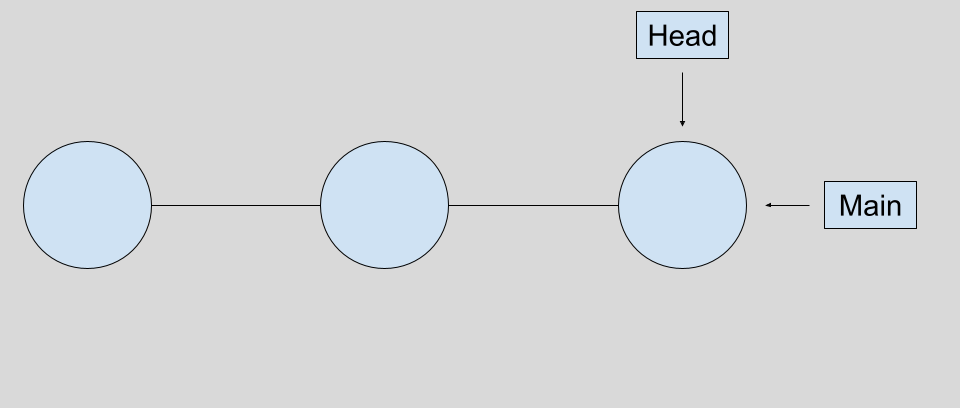

# Git Introduction

## What is Git?

In the simplest terms, git is software that allows you to version control projects, usually consisting of software. What this means in practice is git allows you to track changes to file(s) at user defined points creating a history of the changes to that file(s). What is powerful about this is this allows you to revert changes to code fairly easily, as well as allow for multiple developers (or collaborators) to work on a set of code from the same change point without worrying about overwriting what the other has done (more on this later). To illustrate how this all works, the below will walk you through the process and useful commands of git.

## Creating a Local Git Repository

Say you want to create a local git repository on your computer in the directory ``my_project``, you can initialize the repository as follows:

	cd my_project
	git init

And BOOM! you have your first repository. 

## Adding Files to your Local Repository

Of course, this is not super useful until you start adding code to it. So, say now that you know you want to start your project with a spectra reduction script called ``spectra_reduction.py``. First, you should create the file in your directory and then you can add it to your repository by:

	git add spectra_reduction.py

At this point, the file is only staged to be added to your local repository. At this point, you can add multiple files under the same commit (shown in a sec). Once you are done staging your files, you then commit them to the local repository:

	git commit -m "Add initial script for reducing spectra"

Now your file in its current status has been added to your local repository.

## Recording Changes to Files in your Local Repository

Now, lets say that you added a new function to find radial velocities from a spectra to your script, in order to record this change you need to make a new commit. First, after adding the new function you can run:

	git status

which will show you all files in the repository that have untracked changes along with untracked (i.e.) new files that have not been added to the local repository. In this example, running the command would produce:

	On branch main
	Your branch is up to date with 'origin/main'.

	Changes not staged for commit:
	  (use "git add <file>..." to update what will be committed)
	  (use "git checkout -- <file>..." to discard changes in working directory)

		modified:   spectra_reduction.py

Again, to stage and add the file you would run the following:

	git add spectra_reduction.py
	git commit -m "Add RV fitting function"

## Reseting vs. Checking Out vs. Reverting

There are multiple ways to undo things you have done with git, though all of them have different consequences. For this current example, lets say that we make some changes to the RV fitting function:

	git add spectra_reduction.py
	git commit -m "Change algorithm for RV fitting function"

but we no longer like these changes. There are a few ways we can deal with undoing these changes, which are summarized below.

### Reseting

Reseting in git will actually move the head (i.e. where you are in the commit history) backwards to a certain point. So, say for example we wanted to go backwards one commit and redo adding that function to our file, we could run the following:

	git reset HEAD-1

Now, you have essentially removed the commit of adding the RV fitting function from the history like it never existed. Visually, this looks like the following:

<figure>
    
    <figcaption class="figure-caption text-center">Before Reset</figcaption>
</figure>

This can be good/bad depending on the application. One note from most online resources is that this type of action should NEVER be done with a public repository as it removes all of the commits ahead of the new head. There will be better options for public repositories discussed below.

### Checking Out

Checking out is similar in some ways to reset, in that is moves the head to a previous commit